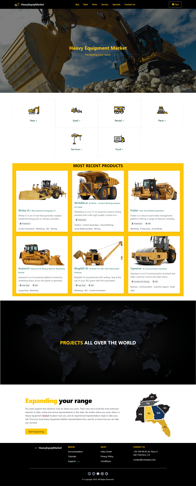
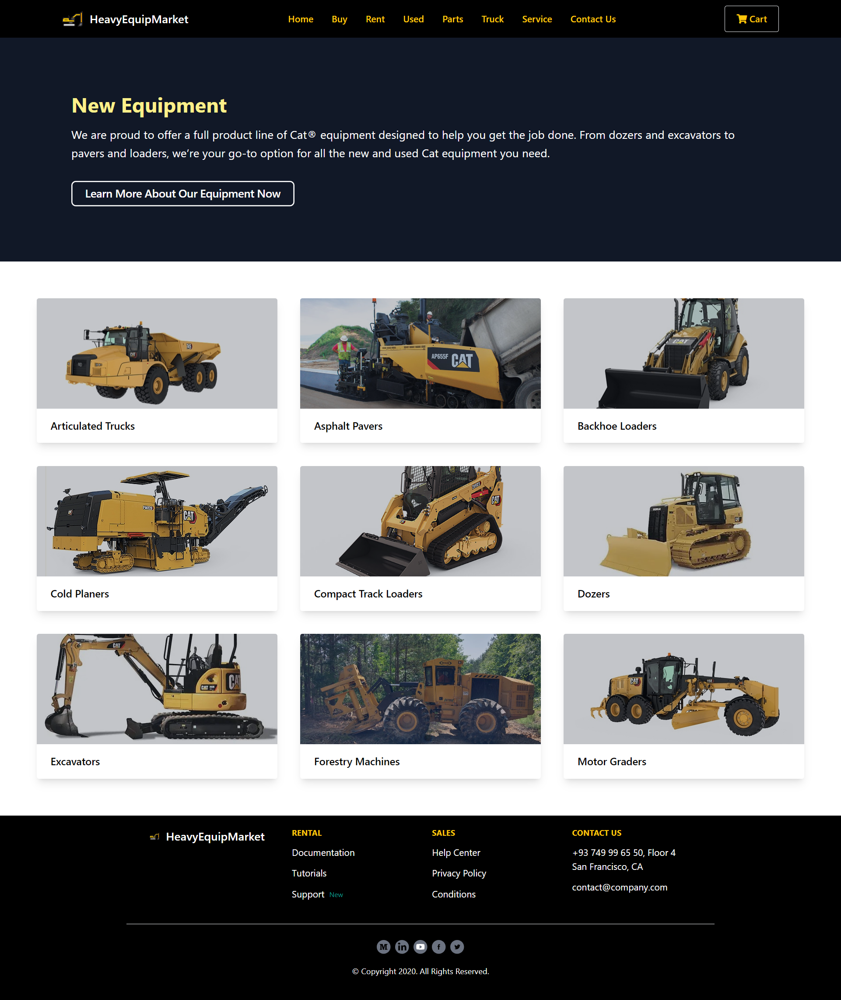
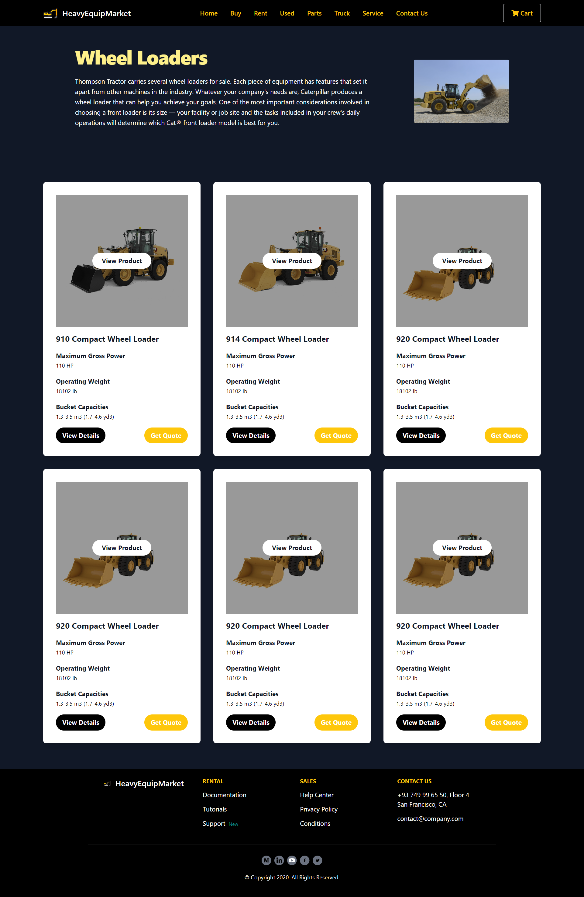
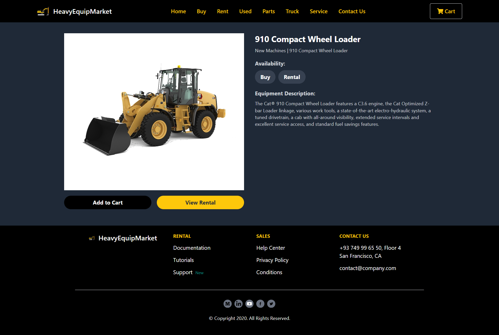
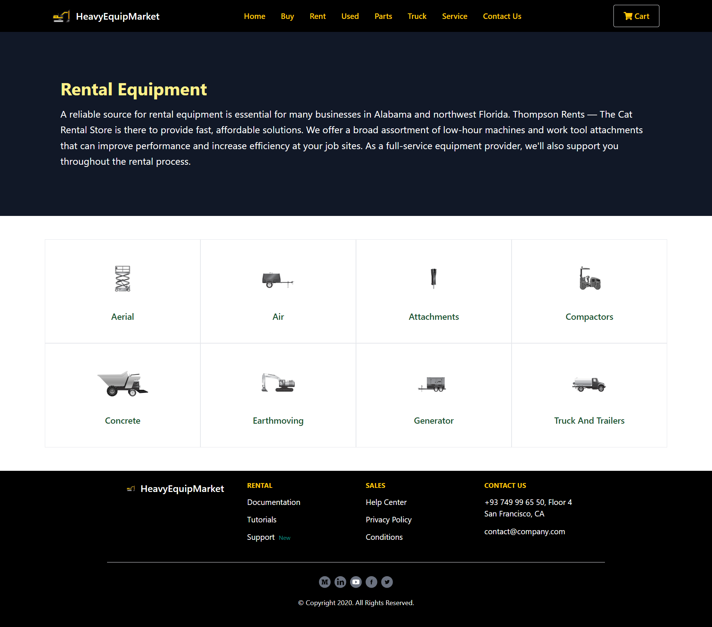
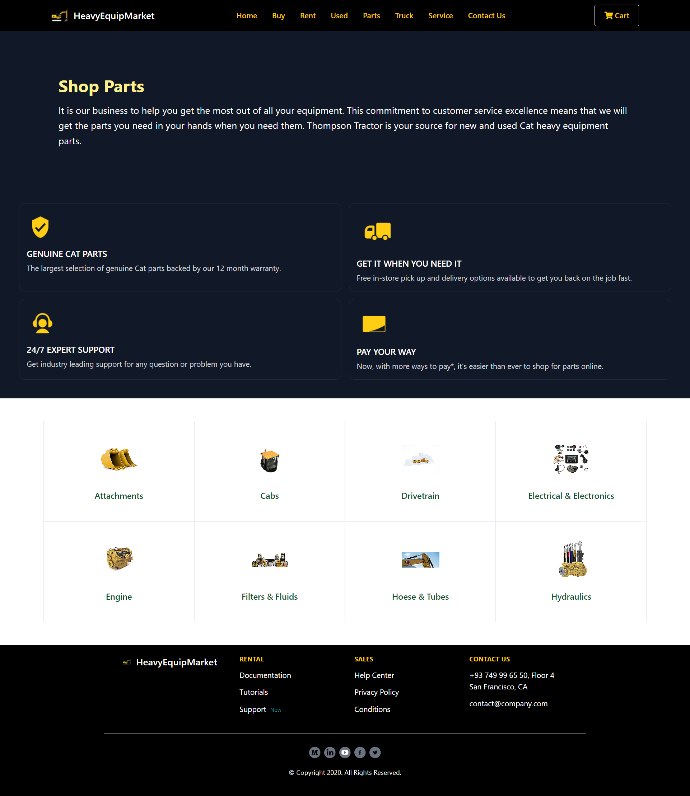
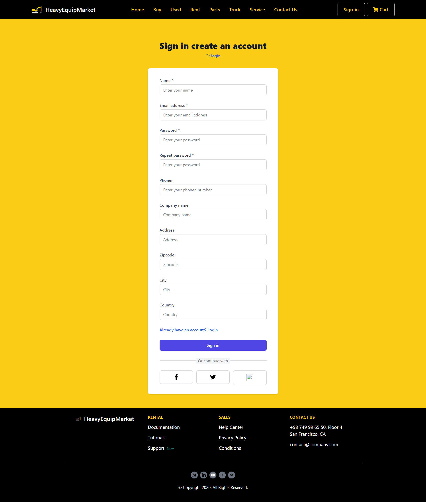
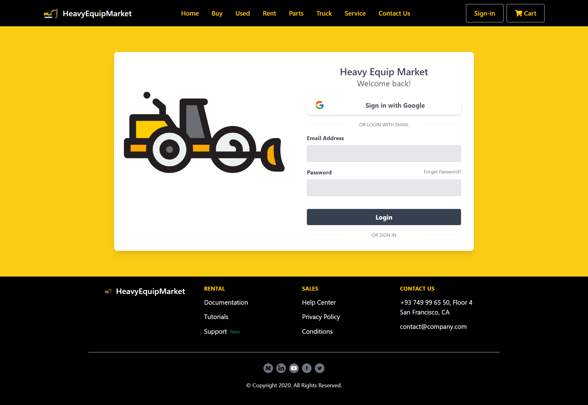
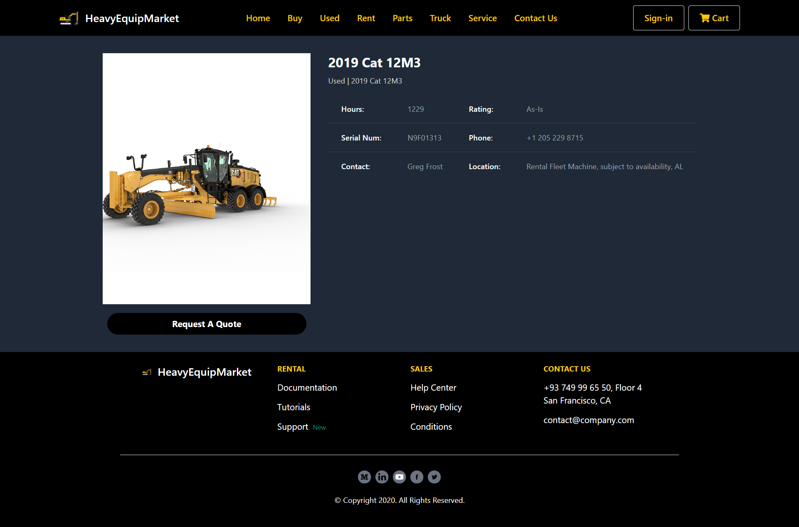
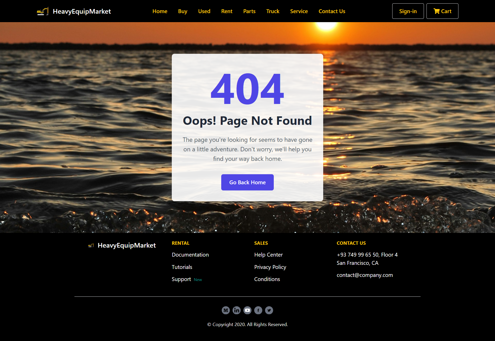

# Heavy Equip Market 🚜 

Heavy Equip Market 🛒 is a web platform designed to connect buyers and sellers in the heavy equipment industry. Whether you're in construction, mining, agriculture, or any other sector requiring heavy machinery, this platform serves as a centralized marketplace for buying, selling, and renting equipment. Users can browse a wide range of heavy equipment listings, including excavators, bulldozers, cranes, and more. Sellers can showcase their inventory, while buyers can easily find the machinery they need.


## Example Site:

| |  |  |
|:---:|:---:|:---:|
| **Homepage**  | **New-Equipment**  | **New-Machine-Family**  |
|  |  |  |
| **Equipment-Details** | **Rental-Equipment** | **Parts** | 
|  |  |  |
| **Sign-in** | **Login** | **Used-Equipment-Details** | 
|  |  |  |
| **Not Found** |  
|  | 


## Who It's For:

- **Construction Companies:** Find the right equipment for your projects, whether you need excavators, loaders, or dump trucks.
- **Mining Companies:** Source heavy machinery for mining operations, such as drills, crushers, and loaders.
- **Agricultural Businesses:** Discover agricultural equipment like tractors, combines, and sprayers to streamline farm operations.
- **Contractors:** Rent or purchase specialized equipment for specific tasks, from demolition to road construction.
- **Equipment Dealers:** Showcase your inventory to a wide audience, facilitating sales and rentals.
- **Individuals:** Explore options for personal projects or smaller-scale operations, such as landscaping or DIY construction.


## Getting Started

To get started with Heavy Equip Market, follow these steps:

#### Prerequisites:

Before you begin setting up Heavy Equip Market, make sure you have the following installed and configured:

- **Python:** Heavy Equip Market is built using Python, so ensure you have Python installed on your system. You can download it from the [official Python website](https://www.python.org/).
- **Django and Django Rest Framework:** Heavy Equip Market utilizes Django and Django Rest Framework for backend development. Install them using pip:
``` 
pip install django djangorestframework
```
- **PostgreSQL:** Heavy Equip Market uses PostgreSQL as its database. Install PostgreSQL and set up your database configuration accordingly. You can download PostgreSQL from the [official PostgreSQL website](https://www.postgresql.org/).
- **Vue.js:** Heavy Equip Market's frontend is built with Vue.js. Make sure you have Vue.js installed globally on your system. You can install it via npm:
```
npm install -g @vue/cli
```
- **Tailwind CSS:** Tailwind CSS is used for styling the frontend. You can install it via npm
```
npm install tailwindcss
```

#### Installation backend

1. Clone the repository to your local machine:
```
git clone <repository_url>
```

2. Navigate to the project directory:
```
cd heavy-equip-market
```

3. Create a virtual environment (optional but recommended):
```
virtualenv venv
```

4. Activate the virtual environment:
- On Windows:
    ```
    env\Scripts\activate.bat
    ```
- On macOS/Linux:
    ```
    source venv/bin/activate
    ```

5. Install the project dependencies:
```
pip install -r requirements.txt
```

#### Installation fronend 

1. Navigate to the Frontend Directory:
```
cd frontend
```

2. Install Dependencies:
```
npm install
```

3. Compile Tailwind CSS:
```
npm install tailwindcss
```

4. Run the Application:
```
npm run dev
```


## Technologies Used

Heavy Equip Market utilizes the following technologies:

- **Django and Django Rest Framework**: Django is a high-level Python web framework that encourages rapid development and clean, pragmatic design. Django Rest Framework is a powerful toolkit for building Web APIs in Django.
  
- **PostgreSQL**: PostgreSQL is a powerful, open-source relational database management system used for storing data in Heavy Equip Market.

- **Vue.js**: Vue.js is a progressive JavaScript framework used for building user interfaces. It allows for the creation of interactive and dynamic frontend components in Heavy Equip Market.

- **Tailwind CSS**: Tailwind CSS is a utility-first CSS framework used for styling the frontend of Heavy Equip Market. It provides low-level utility classes that can be composed to build custom designs without the need for writing custom CSS.

These technologies work together to create a robust and efficient web platform for buying, selling, and renting heavy equipment.

## Contributing:

Contributions are welcome! Feel free to submit bug reports, feature requests, or pull requests to improve the platform.

## Author

- [@mahmoudessam820](https://github.com/mahmoudessam820)

## 🔗 Links

[](https://www.linkedin.com/in/mahmoud-el-kariouny-822719149/)
[](https://twitter.com/Mahmoud42275)


## Feedback

If you have any feedback, please reach out to us at esame4166@gmail.com
